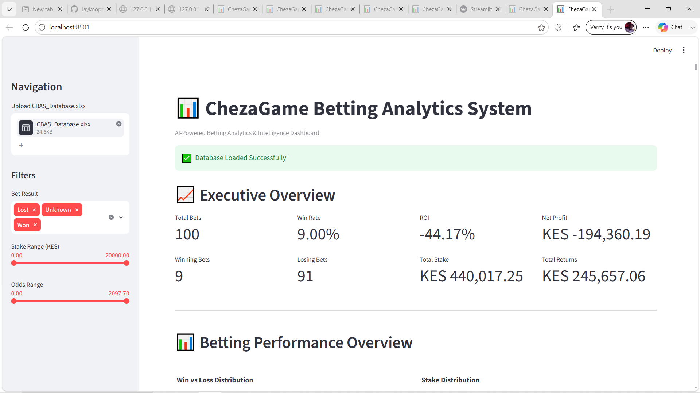
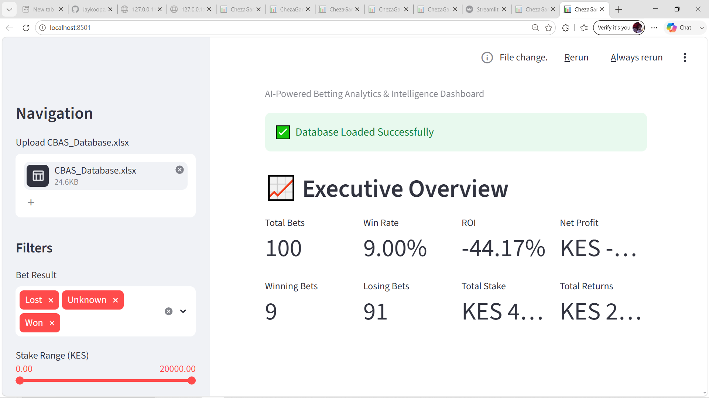
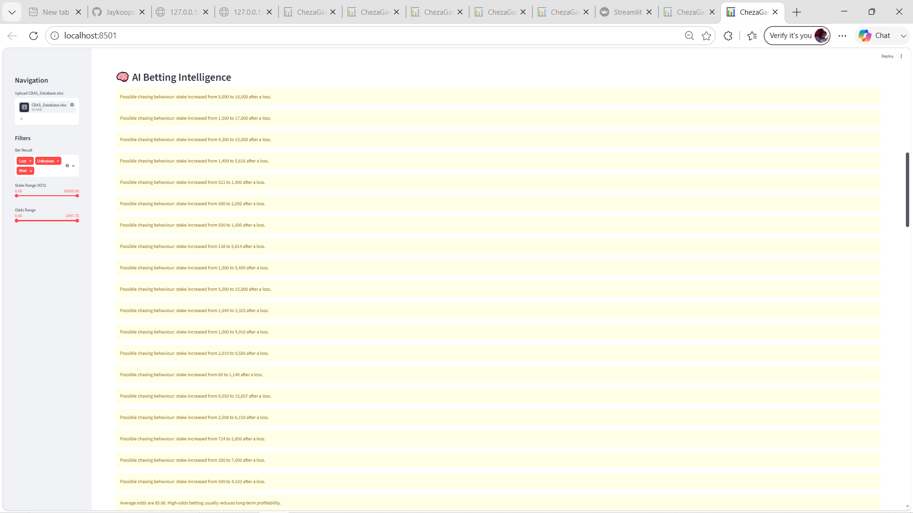

# 📊 ChezaGame Betting Analytics System (CBAS)


## Overview

ChezaGame Betting Analytics System (CBAS) is a Python-based analytics platform that automates the processing of sports betting slips, transforms betting history into structured datasets, and provides interactive analytics through an executive dashboard.

The system combines Optical Character Recognition (OCR), data cleaning, business analytics, artificial intelligence, and interactive visualization to help users understand betting performance and identify behavioural patterns.

---

## Features

### OCR Processing

- Extracts betting information from betting slips
- Parses selections automatically
- Converts unstructured text into structured data

### Data Management

- Builds a structured Excel database
- Cleans and validates betting records
- Stores bets and selections separately

### Betting Analytics

- Return on Investment (ROI)
- Win Rate
- Profit/Loss Analysis
- Stake Analysis
- Odds Analysis
- Performance Trends

### Artificial Intelligence

- Betting Intelligence Engine
- Stake Chasing Detection
- Bankroll Management Analysis
- High Odds Detection
- Strategy Recommendations

### Interactive Dashboard

- Executive KPI Cards
- Win/Loss Pie Chart
- Stake Distribution
- Odds Distribution
- Profit Distribution
- Profit Trend
- Stake vs Returns
- Odds vs Profit
- Betting Health Score
- AI Risk Score
- Executive Recommendations

### Reporting

- Executive Summary
- CSV Export
- Text Report Generation

---

# Dashboard Preview

> Screenshots will be added here.

```
docs/screenshots/dashboard_home.png
docs/screenshots/analytics.png
docs/screenshots/ai_insights.png
```

---

# Project Structure

```text
ChezaGame-Betting-Analytics-System/
│
├── dashboard.py
├── main.py
├── requirements.txt
├── README.md
│
├── data/
├── docs/
├── logs/
├── output/
├── reports/
├── scripts/
└── tests/
```

---

# Technologies Used

- Python
- Pandas
- Streamlit
- Plotly
- OpenPyXL
- OCR
- Object-Oriented Programming
- Data Analytics
- Business Intelligence

---

# Installation

Clone the repository

```bash
git clone https://github.com/YOUR_USERNAME/ChezaGame-Betting-Analytics-System.git
```

Open the project

```bash
cd ChezaGame-Betting-Analytics-System
```

Install dependencies

```bash
pip install -r requirements.txt
```

---

# Running the Command Line Application

```bash
python main.py
```

---

# Running the Dashboard

```bash
streamlit run dashboard.py
```

---

# Example Workflow

1. Upload betting slips
2. OCR extracts betting information
3. Data is cleaned
4. Excel database is created
5. Analytics are generated
6. Dashboard displays interactive insights
7. AI produces betting recommendations

---

# Future Improvements

- Machine Learning Prediction
- SQLite Database
- PDF Report Generator
- PowerPoint Export
- User Authentication
- Cloud Deployment
- Mobile Dashboard

---

# Author

**Jacob Mutuma Mugambi**

Human Resource Officer | Business Analytics Enthusiast | Python Developer

Kenya

---

# License

This project is licensed under the MIT License.

## Dashboard Preview

### Home Dashboard



### KPI Cards



### AI Intelligence

